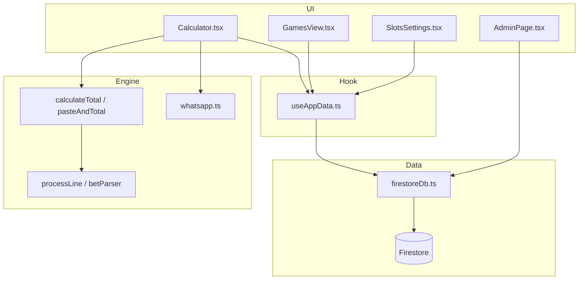

# Number Calculator — Project takeover guide

This document is written for someone who did not build the app and needs to **understand, run, deploy, and maintain** it. Read sections in order the first time; use the index later as a reference.

**Related docs**

| File | What it covers |
|------|----------------|
| [SCHEMA.md](../SCHEMA.md) | Firestore collections, field-by-field JSON shapes, query patterns |
| [README.md](../README.md) | Short intro, run/build/deploy commands |
| [docs/FIXLIST.md](./FIXLIST.md) | User-facing bug/feature wish list |

---

## 1. What this app does (business view)

This is an **internal admin tool** for a numbers / matka-style betting workflow:

1. **Paste WhatsApp chat** exports (or plain number lines).
2. The app **parses** each line (jodis, rates, WP/palat, Harf, same-digit runs, etc.) and shows a **line-by-line total**.
3. On **Calculate / Save**, it stores data in **Firebase Firestore**:
   - Who sent bets (**contact**), on which **day**, for which **game slot** (time-based markets).
   - **Payment** records (amount received, commission).
4. **Payments** tab: see daily/monthly totals, pending vs received, commission earned.
5. **Settings**: configure game slots (name, result time, emoji) and default commission %.
6. **Admin** (`/admin`): audit log of past calculations, parser drift checks, report-issue inbox, push notifications (optional).
7. **Statement** (`/statement`): upload PDF statements, extract columns (separate feature).

There is **no traditional backend server** for normal CRUD. The React app talks to Firestore from the browser. One **Vercel serverless function** exists only for FCM push when someone reports a parsing issue.

---

## 2. Tech stack

| Layer | Technology |
|-------|------------|
| UI | React 18, TypeScript, Tailwind CSS 4 |
| Build | Vite 6 |
| Database | Firebase **Firestore** (NoSQL documents) |
| Hosting | Vercel (static SPA + `api/notify-report-issue.js`) |
| Tests | Vitest (`npm test`) |
| PDF (statement) | pdf.js, jspdf |

**Important:** Firebase config and admin login credentials are baked into the **client bundle** via `VITE_*` env vars at build time. They are not secret from anyone who opens the built JS — treat Firestore rules and login as a **light gate**, not bank-grade security (see §12).

---

## 3. Repository map

```
number-calculator/
├── src/
│   ├── main.tsx              # Entry: routes / vs /admin vs /statement
│   ├── App.tsx               # Main shell: 3 tabs (Calculate, Payments, Settings)
│   ├── Calculator.tsx        # Paste → parse → save sessions/payments
│   ├── GamesView.tsx         # Payments tab UI
│   ├── SlotsSettings.tsx     # Settings tab (slots + commission)
│   ├── History.tsx           # History overlay (by date / contact)
│   ├── AdminPage.tsx         # /admin — audit logs, reports, parser preview
│   ├── StatementPage.tsx     # /statement — PDF extract
│   ├── EditableBreakdown.tsx # Per-line bet breakdown UI
│   ├── ReportIssue.tsx       # “Report wrong total” form
│   │
│   ├── calc/                 # ★ Core parsing engine (no React)
│   │   ├── betParser.ts      # processLine() — one line → segments
│   │   ├── pasteAndTotal.ts  # calculateTotal() — full paste pipeline
│   │   ├── textNormalize.ts  # Typos, WhatsApp bold, “into” rates
│   │   ├── whatsapp.ts       # Parse WA headers → messages
│   │   ├── sessions.ts       # mergeIntoSessions, ledger helpers
│   │   ├── slotsTime.ts      # Slot time → minutes, overnight dates
│   │   ├── market.ts         # GL/DB/FB market line detection
│   │   └── settingsPayments.ts
│   │
│   ├── data/
│   │   └── firestoreDb.ts    # ★ All Firestore read/write (single file)
│   ├── hooks/
│   │   └── useAppData.ts     # Loads config on startup; exposes save/load fns
│   ├── config/
│   │   └── firebase.ts       # Firebase app + Firestore init
│   ├── auth/                 # Cookie login for /admin and /statement
│   ├── types/index.ts        # TypeScript interfaces
│   ├── lib/calcUtils.ts      # Re-exports calc/* (legacy import path)
│   └── ui/                   # Shared buttons, modals, cards
│
├── api/
│   └── notify-report-issue.js   # Vercel serverless (FCM push)
├── scripts/
│   └── write-fcm-sw.mjs           # Generates public/firebase-messaging-sw.js
├── firestore.rules            # Currently: allow all read/write
├── vercel.json                # SPA rewrites for /admin, /statement
├── SCHEMA.md                  # Database reference
└── docs/PROJECT_GUIDE.md      # This file
```

---

## 4. Run locally

```bash
npm install
cp .env.example .env   # then fill in Firebase + optional login (see §5)
npm run dev
```

Open **http://localhost:5173**

- Main app: `/`
- Admin: **http://localhost:5173/admin** (requires login if env set)
- Statement: **http://localhost:5173/statement**

`npm run build` → production bundle in `dist/`  
`npm test` → Vitest (parser regressions live in `src/lib/calcUtils.test.ts` and `src/calc/*.test.ts`)

Before dev/build, `predev` / `prebuild` run `npm run fcm:sw` to write the Firebase messaging service worker.

---

## 5. Environment variables

Create a `.env` file in the project root (never commit real values).

### Required for Firestore

```env
VITE_FIREBASE_API_KEY=
VITE_FIREBASE_AUTH_DOMAIN=
VITE_FIREBASE_PROJECT_ID=
VITE_FIREBASE_STORAGE_BUCKET=
VITE_FIREBASE_MESSAGING_SENDER_ID=
VITE_FIREBASE_APP_ID=
```

Get these from [Firebase Console](https://console.firebase.google.com) → Project settings → Your apps → Web app config.

### Optional — admin / statement login

```env
VITE_APP_LOGIN_USERNAME=
VITE_APP_LOGIN_PASSWORD=
```

If both are set, `/admin` and `/statement` show a login modal. Credentials are compared in the browser (`src/auth/appLoginEnv.ts`). Main calculator `/` does **not** require login (only “Login” link to open admin).

### Optional — report issue push notifications

| Variable | Where | Purpose |
|----------|--------|---------|
| `VITE_FIREBASE_VAPID_KEY` | `.env` | Web push (browser) |
| `VITE_REPORT_NOTIFY_SECRET` | `.env` + Vercel | Shared secret with API |
| `VITE_REPORT_NOTIFY_URL` | `.env` (local dev) | e.g. `https://your-app.vercel.app` so local app hits deployed API |

**Vercel** (serverless, not in client bundle):

| Variable | Purpose |
|----------|---------|
| `FIREBASE_SERVICE_ACCOUNT_JSON` | Firebase Admin SDK (FCM) |
| `REPORT_NOTIFY_SECRET` | Must match `VITE_REPORT_NOTIFY_SECRET` |
| `APP_PUBLIC_URL` | Link in push notification |

---

## 6. Routes and pages

`src/main.tsx` chooses what to render from `window.location.pathname`:

| Path | Component | Auth |
|------|-----------|------|
| `/` | `App` | No |
| `/admin`, `/audit` | `AdminPage` | `ProtectedAppSession` |
| `/statement` | `StatementPage` | `ProtectedAppSession` |
| `/learning` | `LearningPage` | `ProtectedAppSession` — career path curriculum ([LEARNING_CURRICULUM.md](./LEARNING_CURRICULUM.md)) |

`vercel.json` rewrites `/admin` and `/statement` to `index.html` so client-side routing works after deploy.

### Main app tabs (`App.tsx`)

1. **Calculate** — `Calculator.tsx` (always mounted; hidden when other tab selected so paste state is preserved).
2. **Payments** — lazy `GamesView.tsx` (daily/monthly money view).
3. **Settings** — lazy `SlotsSettings.tsx` (slots + commission %).

Data comes from `useAppData()` hook: slots, settings, and functions like `saveSessionDoc`, `loadPaymentsByDate`, etc.

---

## 7. Firestore for beginners

### What is Firestore?

Think of it as **JSON documents in folders**:

- A **collection** is a folder name (`sessions`, `payments`).
- A **document** is one JSON object with an **ID** (like a filename).
- The app uses the **Firebase JavaScript SDK** in the browser: `getDoc`, `setDoc`, `getDocs`, `query`, `where`.

All database code is centralized in **`src/data/firestoreDb.ts`**. UI components should not import `firebase/firestore` directly — go through `useAppData` or `firestoreDb` exports.

### Collections (summary)

| Collection / path | Purpose |
|-------------------|---------|
| `config/slots` | Array of game slot definitions |
| `config/settings` | `{ commissionPct }` |
| `sessions/{id}` | One person’s bets for one day |
| `payments/{id}` | Payment + commission per person × slot × day |
| `gameResults/{id}` | Winning number per slot per day (optional) |
| `calc_audit_logs/{autoId}` | Log each calculate (admin analytics) |
| `report_issues/{autoId}` | User-reported parser issues |
| `statementExtracts/{fingerprint}` | Cached PDF extract rows |
| `report_push_tokens/{autoId}` | FCM tokens for admin push |

Full field lists: **[SCHEMA.md](../SCHEMA.md)**.

### Document IDs and dates

Dates in IDs use `DD/MM/YYYY` but `/` is forbidden in Firestore IDs, so slashes become `__SL__`:

- Logical id: `Ramesh Ji P|italy|16/05/2026`
- Firestore doc id: `Ramesh Ji P|italy|16__SL__05__SL__2026`

Inside the document, `date` stays `16/05/2026`; `dateISO` is `2026-05-16` for month range queries.

### How the app loads data

```
App start
  → useAppData()
      → migrateOldFirestoreData() once (localStorage flag fb_db_migrated_v2)
      → loadSlotsDB() + loadSettingsDB()
      → mirror to localStorage backup
  → User opens Payments / History
      → loadSessionDatesForMonth()  (calendar dots)
      → loadSessionsByDate(date) + loadPaymentsByDate(date)
```

Sessions and payments are **not** loaded entirely at startup — only config is.

### How saves work (Calculate)

```
Calculator: user pastes text → Calculate
  → parseWhatsAppMessages() OR calculateTotal() on plain text
  → mergeIntoSessions() (in memory)
  → saveSessionDoc() for each affected session
  → upsertPaymentStubs() → savePaymentDoc() for each contact×slot×day
  → logCalculationAudit() (optional analytics)
```

---

## 8. Frontend architecture (data flow)



**Dual-write for config:** When you save slots or settings, the app writes to Firestore **and** `localStorage` (`gameSlots`, `appSettings`) so offline fallback works if Firebase fails on next load.

---

## 9. Calculator / parsing engine

This is the most complex part of the project. Changes here need **tests**.

### Pipeline (high level)

1. **`preprocessText`** — strip WhatsApp headers, normalize line endings.
2. **Line merging** (`pasteAndTotal.ts`) — join broken lines (`Into5` on next row), pending number rows until a rate appears, comma continuations, etc.
3. **`normalizeTypoTolerantInput`** — fix `×` → `x`, `43/10` → `43x10`, bold `78*73*`, glued `HarfAxBx`, etc.
4. **`processLine`** (`betParser.ts`) — one logical line → array of **`Segment`**:
   - `line`, `rate`, `count`, `lineTotal`, `isWP`, `isDouble`, `lane` (A/B/AB).
5. **`calculateTotal`** — sum all segments; collect `failedLines` that did not parse.

### Key concepts

| Term | Meaning |
|------|---------|
| **Jodi** | Two-digit number (e.g. `47`) |
| **Rate** | Stake multiplier (e.g. `x10`, `(75)`, trailing `- 28`) |
| **WP / palat** | Reverse pair counting (47 counts 47 + 74 once per pair family) |
| **Same-digit run** | `77777`, `4444` — special AB/A/B rules |
| **Multi-x chain** | `B.1111x9999x50` — two runs, same rate 50 |
| **Slot** | Game market by time (Disawar, Gali, etc.) |

### Where to edit

| Task | File(s) |
|------|---------|
| New line format / bug in one line | `betParser.ts`, maybe `textNormalize.ts` |
| Multi-line paste / merge rules | `pasteAndTotal.ts` |
| WhatsApp header / timestamp | `whatsapp.ts`, `slotsTime.ts` |
| Market labels `DB.`, `GL.` | `market.ts`, `stripLeadingGameLabels` in `betParser.ts` |
| Regression test | `src/lib/calcUtils.test.ts` |

**Always add a test** with the exact pasted string and expected total when fixing parser bugs.

### WhatsApp slot detection

`detectSlotFromTimestamp` in `Calculator.tsx`: message time is compared to each enabled slot’s `time` (24h). The message is assigned to the **next** slot whose result time is **after** the message (overnight logic in `ledgerDateStringForSlot` / `slotsTime.ts`).

---

## 10. Key files reference

| File | Responsibility |
|------|----------------|
| `src/data/firestoreDb.ts` | Every Firestore operation |
| `src/hooks/useAppData.ts` | Startup load, migrations, pass-through saves |
| `src/Calculator.tsx` | Paste UI, calculate, save, game picker, audit |
| `src/GamesView.tsx` | Payments UI, monthly rollup |
| `src/History.tsx` | Past sessions by date |
| `src/AdminPage.tsx` | Audit logs, re-parse preview, bulk delete |
| `src/types/index.ts` | `Segment`, `SavedSession`, `PaymentRecord`, etc. |

---

## 11. Admin page (`/admin`)

Uses Firestore collections **`calc_audit_logs`** and **`report_issues`** (not in original SCHEMA.md — see `firestoreDb.ts` interfaces `CalculationAuditLog`, `ReportIssueLog`).

Features:

- List past calculation inputs and totals (detect when **re-running parser today ≠ saved total**).
- Filter by date, sort, multi-select delete.
- Report issue inbox + mark fixed.
- Optional browser push when a user submits `ReportIssue` from calculator.

Does **not** use `useAppData`; it imports `firestoreDb` directly.

---

## 12. Security and production checklist

1. **Firestore rules** (`firestore.rules`) currently allow **anyone** read/write if they have your project config. Before public exposure, restrict to authenticated users or custom claims.
2. **Admin password** is in the client bundle — use a strong password and treat as obfuscation only.
3. Rotate Firebase API keys if the repo was ever public without rules locked down.
4. Enable Firebase App Check if you need abuse protection.

---

## 13. Deployment (Vercel)

1. Connect GitHub repo to Vercel.
2. Framework preset: **Vite**.
3. Set all `VITE_*` env vars for Production (and Preview if needed).
4. Set serverless env: `FIREBASE_SERVICE_ACCOUNT_JSON`, `REPORT_NOTIFY_SECRET`, `APP_PUBLIC_URL`.
5. Deploy — `vercel.json` handles SPA routes.

Firebase Hosting is **not** required; the app uses Vercel + Firestore.

Deploy Firestore rules separately:

```bash
firebase deploy --only firestore:rules
```

(requires Firebase CLI and `firebase.json` project linked)

---

## 14. Testing

```bash
npm test
```

Important suites:

- `src/lib/calcUtils.test.ts` — parser + `calculateTotal` scenarios (largest).
- `src/calc/whatsappRegression.test.ts` — bulk real WhatsApp fixture.
- `src/calc/calcRefactor.test.ts` — barrel export parity.

When fixing parsing, add a test case with:

- `input`: exact paste string
- `expectedTotal` or `toMatchObject` on segments

---

## 15. Common maintenance tasks

### Change commission default

Settings tab → saves `config/settings`. Existing payments may have per-row `commissionPct` snapshot.

### Add / rename a game slot

Settings tab → `config/slots`. Renaming triggers `syncPaymentSlotNamesToMatchSlots` in `useAppData` when slots save.

### Parser returns wrong total

1. Reproduce with exact paste in dev.
2. Debug: `calculateTotal(paste)` in test or temporary `it()` in `calcUtils.test.ts`.
3. Fix `textNormalize` / `betParser` / `pasteAndTotal`.
4. Run `npm test`.

### Clear bad data in Firestore

Use Firebase Console → Firestore → delete documents, or Admin page bulk delete for audit logs only.

### User cannot connect to database

- Check `.env` Firebase vars and network.
- Browser console for `[firebase]` warnings.
- App shows yellow banner “Could not reach database — using local data” and falls back to localStorage for slots/settings only.

---

## 16. Mental model checklist (takeover)

- [ ] I can run `npm run dev` with a valid `.env`.
- [ ] I understand **sessions** = bets per person per day; **payments** = money per person per slot per day.
- [ ] I know parser logic is in **`src/calc/`**, not only `calcUtils.ts`.
- [ ] I know all DB access is **`firestoreDb.ts`**.
- [ ] I read **SCHEMA.md** for document shapes.
- [ ] I run **`npm test`** before deploying parser changes.

---

## 17. Glossary

| Word | In this app |
|------|-------------|
| Contact | WhatsApp name or phone from paste header |
| Session | All messages from one contact on one calendar day |
| Slot / game | Timed market (e.g. Gali 23:17) |
| Segment | One parsed bet row with count × rate |
| Stub payment | `amountPaid: null` created when bets are saved |
| Audit log | Copy of paste + total on each calculate (admin) |

---

*Last expanded for project takeover documentation. Update this file when you add collections, routes, or major features.*
